# 4.2.1 善用Android Lint

***

书中4.2.1章节中提到了Android Lint，这是Android应用代码的静态分析器，作者用它找出了编译器没有发现的类型不匹配错误。如下图，该项目中发现42个可能有问题的地方，详细的类型见下文。

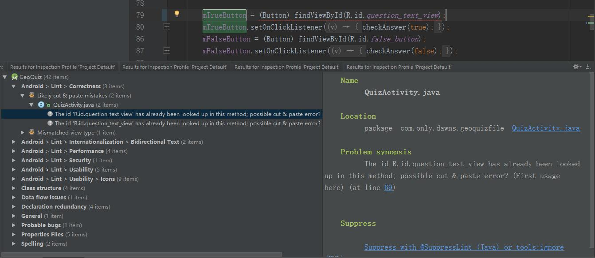

 我们人为制造的这个类型不匹配的错误，Android Lint找到了，很有趣的是它说我们可能复制错了。书中只解决了这一个问题，但是还有其他问题我们也还是要解决的。

讲个段子，“悬崖边上放了一个WARNING 的牌子，结果只有程序猿掉了下去;”。这梗是说程序员不在乎警告，但我们实际编程中应该做到**Treat all warning as error**。把每个警告都当作错误去处理，这样会让我们后续开发容易很多。

## 工作原理

下图是Android Lint的工作流程图，Lint Tool读取App Source Files（应用源文件）和lint.xml（Lint配置文件）加以检查，最后输出检查结果。检查的类型包括有正确性(Correctness)、国际化(Internationalization)、性能(Performance)、安全(Security)、可用性(Usability)、类结构(Class structure)、数据流问题(Data flow issues)、声明(Declaration redundancy)、通用(General)、可能的错误(Probable bugs)、属性文件(Properties Files)、拼写(Spelling)。

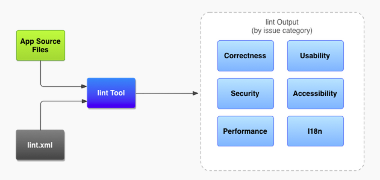、

既然需要读入lint.xml，那Lint肯定是可以检查自定义的问题类型。这里暂时不用自定义Lint，故不展开说，有兴趣的看下面的资料。

[浅谈Android自定义Lint规则的实现 （一）](http://www.carrotsight.com/2016/01/29/%E6%B5%85%E8%B0%88Android%E8%87%AA%E5%AE%9A%E4%B9%89Lint%E8%A7%84%E5%88%99%E7%9A%84%E5%AE%9E%E7%8E%B0%20%EF%BC%88%E4%B8%80%EF%BC%89.html#)

[Android自定义Lint实践](http://tech.meituan.com/android_custom_lint.html#)

[Improve Your Code with Lint](https://developer.android.com/studio/write/lint.html)

## Lint检查类型

- 正确性(Correctness)

  此例体现在ID类型不匹配，修改之。

- 国际化(Internationalization)

  此例中Lint提示我们用start/end来取代left/right，以便支持从右到左的语言环境（见下图）。原先的left/right是绝对对齐，在Android 4.2之后可用start/end来实现基于阅读顺序的对齐。在开发过程中我们无疑要同时使用这两种对齐，以便支持更多Android版本且国际化。这里的两个图片按钮是指示前进或者后退的，我们就不必采用start/end来对齐。我们为按钮设置`tools:ignore="RtlHardcoded"`来跳过这个检查。更多资料请看谷歌官方文档：[Native RTL support](https://developer.android.com/about/versions/jelly-bean.html#42-native-rtl)

  Internationalization](./pic_4.2.1 善用Android Lint/Internationalization.png)

  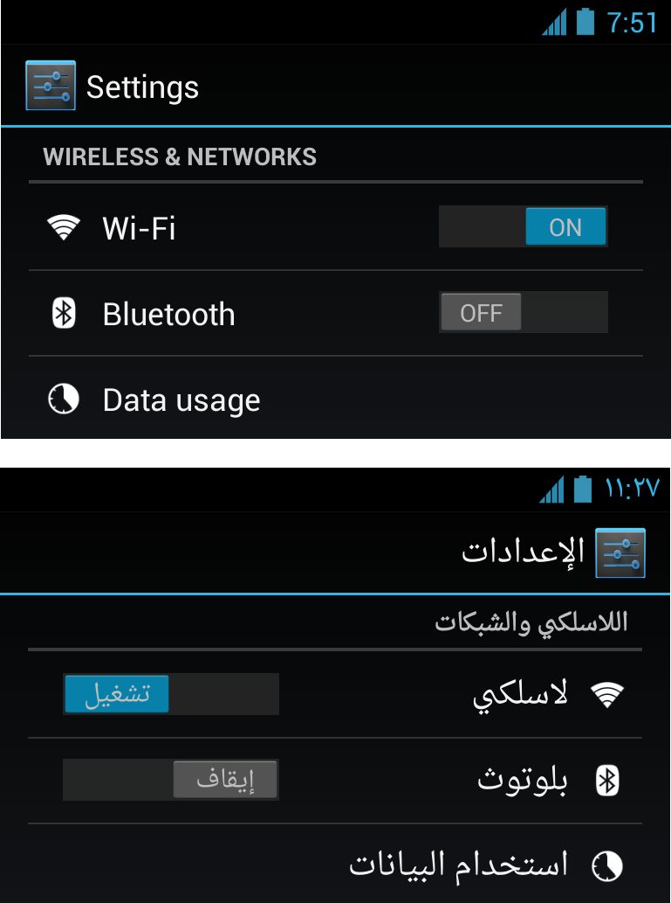

- 性能(Performance)

  - `FrameLayout can be replaced with <merge> tag`

    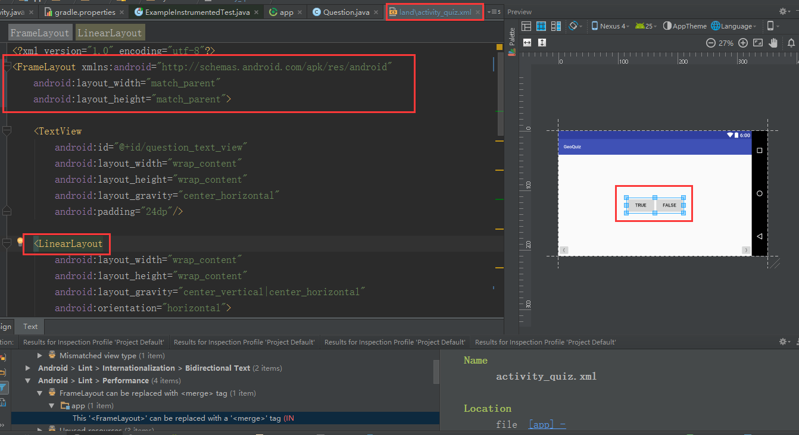

    这个问题<merge>标签的引入有助于在一个布局里又包含一个布局时候，消除视图层次中的冗余视图。于是我将图中FrameLayout代码更改为`<merge xmlns:android="http://schemas.android.com/apk/res/android">`。（更改代码后并提交了一次代码，描述为:"4.2.1 <FrameLayout> replaced with a <merge>"）

    更多资料见：

    [使用merge标签替换FrameLayout布局](https://developer.android.com/about/versions/jelly-bean.html#42-native-rtl)

    [Android布局优化之ViewStub、include、merge使用与源码分析](http://blog.csdn.net/bboyfeiyu/article/details/45869393)

    [Android Layout Tricks #3: Optimize by merging](https://android-developers.googleblog.com/2009/03/android-layout-tricks-3-optimize-by.html)

  - `Unused resources`

    未使用的资源，这个很好处理，就不说了。

- 安全(Security)

  - `AllowBackup/FullBackupContent Problems`

    原文为：On SDK version 23 and up, your app data will be automatically backed up and restored on app install. Consider adding the attribute android:fullBackupContent  to specify an @xml resource which configures which files to backup. More info: https://developer.android.com/training/backup/autosyncapi.html

    意为在Android 6.0之后，应用的数据会自动备份并在安装的时候恢复，我们可以在`android:fullBackupContent`写入一个xml告诉系统我们需要哪些备份的数据文件。我们这个是小程序，就不考虑这个，在AndroidManifest.xml里`<application>`处添加`tools:ignore="AllowBackup"`即可。

- 可用性(Usability)

  - `Button should be borderless`

    原文为：Button bars typically use a borderless style for the buttons. Set the style="?android:attr/buttonBarButtonStyle" attribute on each of the buttons, and set style="?android:attr/buttonBarStyle" on the parent layout http://developer.android.com/design/building-blocks/buttons.html

    我们在一个布局里放了两个按钮，被判断为按钮栏，需要添加样式取消它的边框。我先是按照文档说的给按钮设置`style="?android:attr/buttonBarButtonStyle"`并且给按钮的父布局设置`style="?android:attr/buttonBarStyle"`，发现边框取消后只有按下某个按钮才能看到区分。

    这不是我想要的效果，还好它提供另一种方式来不检查按钮样式，给按钮设置`tools:ignore="ButtonStyle"`即可。

  - `Missing support for Firebase App Indexing`

    缺少对FireBase应用索引的支持，在AndroidManifest.xml里`<application>`处添加`tools:ignore="AllowBackup,GoogleAppIndexingWarning"`即可。

  - `Identical bitmaps across various configurations`

    由于我们之前并没有添加drawable-xxxdpi文件夹去适配这个分辨率，它显示了缺失的警告，可惜我没记录下来。在我复制了drawable-xxdpi文件夹并更名为drawable-xxxdpi后，出现以上错误提示我们在不同分辨率有相同的位图。好聪明呀，我借助了[**free png resizer**](http://images.my-addr.com/resize_png_online_tool-free_png_resizer_for_web.php)生成了40x60像素（比例见下文）的箭头去替换，这个网站优点在于缩放大小之后还能保持背景透明。

  - `Icon density-independent size validation`

    检查发现我们在不同分辨率的箭头的图案大小变化显著，这个也想添加声明跳过检查的，但却显示声明失败：`Throwable: Assertion failed: PsiBinaryFile:arrow_right.png`。我在[关于支持多种屏幕的官方文档](https://developer.android.com/guide/practices/screens_support.html?hl=zh-cn)中找到了六种通用密度之间的 **3:4:6:8:12:16 缩放比率**，按比率要求修改位图大小即可。

    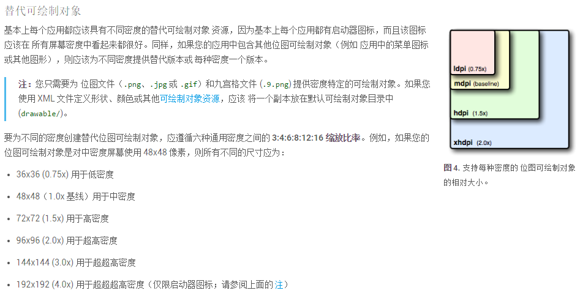

- 类结构(Class structure)

  - `Field can be converted to a local variable`

    这个提示出现在`private Button mTrueButton;`上，意思是可以使用局部变量就不用在这里定义了。

    我们在这句代码上按Ctrl+F1随后按Alt+Enter，可选择`Fix all 'Field can be local'problems in file`一键修改为局部变量(实例:`Button trueButton = (Button) findViewById(R.id.true_button);`)，要注意的是Android Studio在修改的时候并没有加书中让我们设置的'm'前缀。

    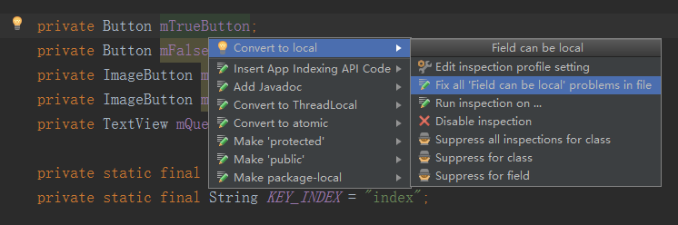

- 数据流问题(Data flow issues)

  - `Not all execution paths return a value`

    这个问题出现在`build.gradle`中，我觉得很奇怪，在网上寻找资料未解决，那暂且按它说的方案去改。选择'Suppress for statement'即可,或者去修改inspection选项中的`Missing Return Statement`。

    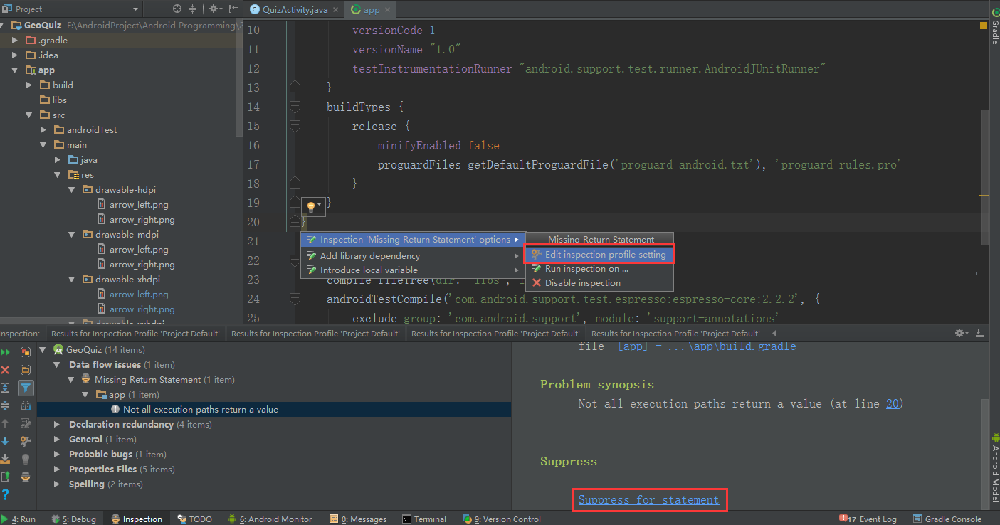

    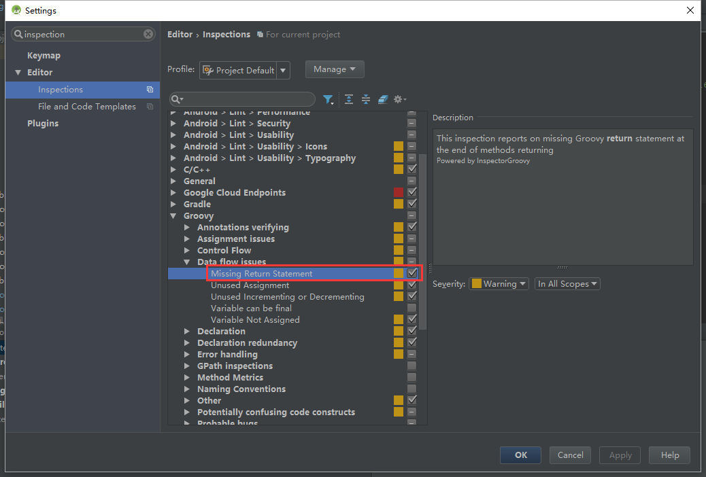

    附上我看的资料，希望有人可以告知这个问题的原因。

    [Convert existing project to library project in Android Studio](http://stackoverflow.com/questions/17614250/convert-existing-project-to-library-project-in-android-studio)

    [Gradle Plugin User Guide](http://tools.android.com/tech-docs/new-build-system/user-guide#TOC-Multi-project-setup)

- 声明(Declaration redundancy)

  - `Declaration can have final modifier`

    提示出现在`public class Question {`，将其改为`class Question {`。

  - `Declaration can have final modifier`

    提示出现在`private Question[] mQuestionBank = new Question[]{`，将其修改为`private final Question[] mQuestionBank = new Question[]{`。

  - `Unused declaration`

    未使用的声明，一是谷歌官方UI测试的文件，二是我们自动生成的Setter方法。这个我们就忽略吧。

    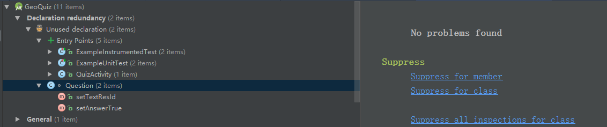

- 通用(General)

  -  `Default File Template Usage`

     原因只是Question类的自动生成的注释我们没有修改，那我们加个'good'好了。

     ```
     /**
     * Created by X on 2016/12/21.
     * good
     */
     ```
    ```

    ```

- 可能的错误(Probable bugs)

  - `Unused assignment`

    我们定义了messageResId且初始化为0，但后面我们又传入了消息的资源ID，定义时候不初始化为0也是可以的，遂删掉'= 0'。

    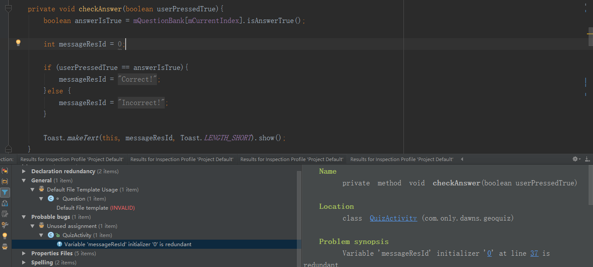

- 属性文件(Properties Files)

  - `Unused Property`

    编译时候提示让我填Proxy，于是我填了但这里显示没用到这属性，还是留着吧，指不定什么时候就得用。
    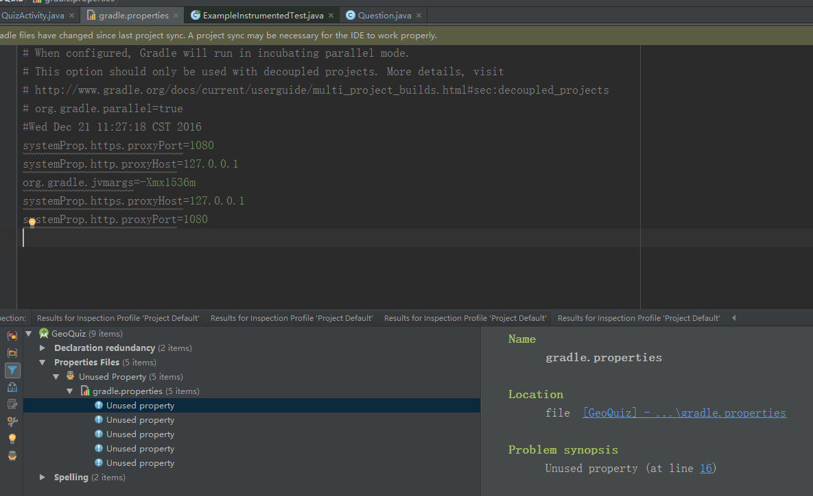

- 拼写(Spelling)

  - `Typo`

    Android Lint觉得‘geoquiz’这是错别字，我不觉得就行了。

## 总结

至此我们总算是践行了**Treat all warning as error**理念，虽然道阻且长，但是这样坚持下去一定有益无害。

（稍后我将提交一次，描述为:"Treat all warning as error".）